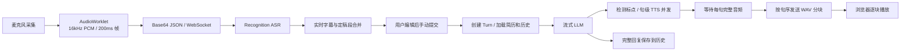

# Rehevo 当前实现审计与优化计划

日期：2026-10-01。范围：实时语音、RAG 入库/检索/生成、相关后端可靠性和对照实验。

## 1. 结论和证据范围

当前项目已经具备较完整的应用编排基础。值得投入的方向是：让语音更快开始、连续播放、取消后上下文正确；让 RAG 找齐技术问题所需的证据，并用同一份证据生成完整且有依据的回答。

本次先读实际链路，再对照官方文档和开源项目。本文中的“已确认”指源码事实，“风险”指由控制流推导的可复现候选问题，“建议”指尚未实施或测得收益的实验方案。

- 源码基准：HEAD `1abb8a3`，工作区含大量已有未提交改动；本文描述的是当前工作区，不能只用 HEAD 复现。
- 配置基准：`application.yml` 与配置类中的默认值。运行时可能被环境变量和设置页面覆盖，启动后需保存脱敏的有效配置。
- 当前本地 Rehevo 应用及其常用数据库端口未运行；已有其他项目容器，未变更它们。
- 本轮没有新产生真实语音或 RAG 性能/质量分数。历史实验按历史条件解释。
- 后端测试命令返回成功，但任务为 `UP-TO-DATE`，不能记为本次新执行的全量测试。
- 依据用户最新要求，本轮先完成链路审计和优化排序。产品实现改动进入后续对照实验阶段。

## 2. 语音：当前完整链路

### 2.1 采集、ASR 与提交

1. `AudioRecorder` 请求浏览器回声消除、降噪和自动增益；与前端 VAD 共用麦克风流。
2. AudioWorklet 转为单声道 16kHz、16bit PCM，累计 3200 个样本，即 200ms 后发送；前端转 Base64，再用 JSON WebSocket 上行。
3. `QwenAsrService` 使用 DashScope `Recognition`，发送音频帧，通过 `RecognitionResult.isSentenceEnd()` 区分临时与定稿文本；语言配置以 `language_hints` 传入。
4. 后端合并多个 ASR 定稿段，更新字幕；不由 ASR 定稿自动触发 LLM。用户可编辑文本，然后手动 `submit`。
5. 应用处理中的迟到 ASR 定稿被丢弃；ASR 未就绪时丢音频，识别连接失败时有重连并重试当前帧的路径。
6. AI 正在说话或回声冷却期时，后端直接丢弃麦克风帧。

**关键判断：当前体验属于“实时识别 + 手动提交 + 流式面试官回复”。现有取消主要由按钮触发。自然说话打断、自动判断回答结束是后续独立体验方案。**

配置类中仍有 `server_vad`、静音时长等字段，但当前 `RecognitionParam` 构造只接入模型、密钥、音频格式、采样率和语言提示。不能认定修改这些旧字段会改变现在的 ASR 行为。实际模型的分段参数需按对应 SDK 文档接入。

### 2.2 LLM 与句级并行合成

- `DashscopeLlmService` 加载简历全文、岗位系统提示和数据库会话历史，通过 `getVoiceChatClient()` 发起流式生成。
- 实时文字下发有频率和增量门槛：默认 180ms、12 字。当前“首 Token”埋点收到的是经过该门槛的文本回调，并非供应商的原始第一个 Token。
- 某个 Token 中出现终止标点，就把累计文本中自上次提交后的内容交给 TTS。
- 每会话最多 3 个 TTS 并发；`OrderedTtsChunkEmitter` 按句序等待结果，保留乱序完成后的输出顺序。
- `QwenTtsService` 新建 `SpeechSynthesizer`，调用 `call(text, 30_000L)`，拿到整个 `ByteBuffer` 后返回 `byte[]`。
- handler 把整句 PCM 包成 WAV，通过 `audio_chunk` 下发；无成功音频时可回退全文合成。
- 默认 TTS 超时配置 8 秒，handler 流式路径实际使用 `max(5, configuredSeconds)`。例如测试配置 1 秒，实际路径仍至少等待 5 秒。

**关键判断：当前已有“LLM 与句级 TTS 重叠”，但没有把供应商逐帧音频实时透传到浏览器。第一句仍需等待完整音频。**

### 2.3 播放、历史与取消

- 浏览器固定按 24kHz、44 字节 WAV 头解码，每次创建 `AudioBufferSourceNode`。
- 前一块 `onended` 后才调用下一块的 `start(0)`；没有基于 `AudioContext.currentTime` 的提前排程。
- 后端 `audio_complete` 表示音频发送阶段完成；前端另外等待队列播放结束。服务端轮次结束不等于用户听完。
- 已有 Turn ID、事件 ID、递增序号和活动 Turn 检查；前端会丢弃取消轮次/旧序号事件，取消按钮立即停本地播放并清队列。
- 服务端取消会改变 Turn 状态、打断处理线程并确认；当前 `VoiceTtsClient` 只有阻塞 `synthesize()`，没有暴露供应商任务句柄或取消接口。
- 服务端在 LLM 返回最终文本后保存完整 AI 回复，时间早于浏览器播报完成。因此中途取消后，下一轮历史可能包含用户未听到的内容。

## 3. 语音：值得优化的具体位置

### V0：先补齐文字、音频、历史的一致性

这是流式提速的前置条件，收益是避免听到半句、字幕回缩和追问引用未播内容。

源码可推导两个边界问题，尚未通过真实供应商音频复现：

1. 若一个流式增量包含 `第一句。第二`，当前逻辑因发现标点，会把包括 `第二` 的整段交给 TTS；需要只发到最后一个有效句界，保留尾部未完成内容。
2. 实时 TTS 使用流式原文，最终 `optimizeForVoice()` 才按默认 120 字截断。因此音频可能已经合成了最终字幕/数据库没有保留的尾部。

改法：统一一个增量文本缓冲器，维护已确认句界和总输出预算；TTS、最终字幕、持久化共用同一份被接受的文本。保护小数、版本号、类名和中英混合术语，避免用任意字符数强切。

对照：固定分块序列，包括标点与下一句同 Token、版本号、小数、长句、Markdown、最后一句无句号。比较拼接 TTS 文本与最终回复；正常轮次必须一致，取消轮次单独标注已播放部分。

### V1：音频到达即推送，降低开口等待

阿里云针对当前 `qwen-audio-3.0-tts-flash` 的 Java 文档提供 `callAsFlowable()` 和 `getAudioFrame()`；本地 2.22.7 SDK 已核对存在对应方法。[Qwen-Audio-TTS Java SDK](https://help.aliyun.com/zh/model-studio/qwen-audio-tts-java-sdk)

建议保留完整句子的语义边界，先把“整句音频全部完成才返回”改为“该句首批有效 PCM 到达即可下发”。后续再比较短分句或双向文本流，避免一次改变所有等待环节。

- 保留旧完整缓冲模式作为 A。
- B 使用音频帧回调、有限缓冲、句内/句间顺序和当前 Turn 校验；空帧、超时、断线均有明确终止结果。
- 按可播放时长控制缓冲；微小帧可合并，但合并等待必须计入首音频时延。
- 流式输出中断后，不以“完整音频”逻辑重播已经播放的前缀；部分失败需有可观察状态。
- 不先调整模型、音色、语速或并发数，以便解释收益来源。

先做 TTS 组件 A/B，记录首个有效 PCM 与合成完成；再做浏览器完整链路 A/B。组件首帧变快不能直接称为用户响应变快。

### V2：提前排程播放，降低断续

Web Audio 支持指定同一音频时钟下的播放开始时间。[AudioBufferSourceNode.start](https://developer.mozilla.org/en-US/docs/Web/API/AudioBufferSourceNode/start)

候选方案：维护下一段预计起播时间，收到片段后在合适时刻提前排程；小幅缓冲吸收网络抖动，保持有界队列，并在取消时停止所有已排程节点。供应商未及时给出后续音频时，明确记录缓冲耗尽。

实验 A：现在 `onended -> start(0)`；B：按音频时钟排程。先固定同一份音频及到达时间表，区分浏览器排程间隙与供应商句内静音；再测真实链路。报告非预期空隙次数/总时长、欠载率和首次播放时延，不把原音频自然停顿计为卡顿。

### V3：取消要覆盖任务、音频队列和历史

Pipecat 的可学习做法是取消在途生成、清理未播音频，并按实际播出的部分维护会话上下文。[Pipecat interruptions](https://docs.pipecat.ai/pipecat/fundamentals/interruptions)

Rehevo 已有活动 Turn 和迟到输出拦截，应进一步补：

- 每轮持有 LLM 订阅、TTS 调用和发送任务的可取消句柄；明确取消是否只停止本地消费，还是终止供应商任务。
- 正常、取消、超时均关闭连接或按协议归还可复用连接。
- 保存生成全文与播放确认分别对应的状态；下一轮只使用已确认传达的内容。先做到句级，若供应商支持文本/音频时间戳再细化。
- 浏览器上报播放开始、已播句及结束；上报超时、乱序和缺失有规则，不能无限等待客户端。

当前 SDK 是 2.22.7，官方 `streamingCancel()` 文档要求至少 2.22.26。方法名存在不等于该版本行为满足协议；若采用此能力，应单独升级、回归与测取消。普通帧流/关闭连接可先单独评估。[Qwen-Audio-TTS Java SDK](https://help.aliyun.com/zh/model-studio/qwen-audio-tts-java-sdk)

### V4：技术术语识别优化

当前 ASR 模型官方标注支持热词与上下文；Java SDK 提供即时 `vocabulary` 参数。现有构造未接入它。[ASR 模型能力](https://help.aliyun.com/zh/model-studio/asr-model/)、[Qwen-Audio-ASR-Streaming Java SDK](https://help.aliyun.com/en/model-studio/qwen-audio-asr-streaming-java-sdk)

候选：按岗位、当前题目和简历抽取少量术语，如 Redisson、pgvector、RRF、ACK、REQUIRES_NEW；词表有数量和权重预算，不把整份简历塞进超强热词。保留原始转写，人工可编辑。

同一组真实中文/中英混合音频，A 无热词、B 少量领域词表。测字符错误率、术语错误率、末尾文字完整率、转写耗时，以及因误识别导致的追问偏题；普通话句子另做无损回归。

### V5：有条件再尝试自动轮次与预测生成

LiveKit 支持手动、VAD、语义轮次等方式；预测生成可能减少等待，也增加取消和重复计算，需实测。[LiveKit turn tuning](https://docs.livekit.io/agents/logic/turns/tuning/)

当前手动提交允许用户检查转写，适合长技术回答。若之后提供自然对话模式，应保留手动模式，单独评估：长停顿误截断率、用户抢话、嗯/对等短回应误打断率、结束后开口延迟和废弃模型调用成本。单纯把静音阈值调小容易伤害思考中的长回答。

前端 200ms 帧可与 100ms 做独立实验；需要补齐结束时不足一帧的尾音 flush，以及非 16kHz 实际采样下的连续重采样精度。没有音频缺失或字幕延迟证据前，不先更换整套传输框架。

## 4. RAG：当前完整链路

### 4.1 入库

- 上传链路同步解析文档、存储原件、保存元数据，再异步做向量化。
- Tika 返回纯文本；文本清理保留段落空行，但没有独立保留页码、标题路径、表格行列和代码块结构的输出。
- `TokenTextSplitter.builder().build()` 使用默认策略，源码注释约 800 tokens、无重叠；没有项目配置驱动的多种切块方案。
- 元数据主要包含 `kb_id`、`chunk_index`、目标知识库与向量任务 ID。当前知识库条目对应上传文件；暂无专门的父段落 ID/结构层级。
- 每批最多 10 块 Embedding；临时 `pending:...` 的 kb_id 在正式知识库过滤中不可见。
- 全部写入成功后，事务中删除旧正式向量并提升当前 job；失败清理临时 job，避免让半成品索引进入正常查询。
- 配置指定 pgvector 1024 维、COSINE、HNSW；数据库实际版本、建成的索引及查询计划仍需运行时核对。

### 4.2 查询与检索

| 环节 | 当前默认/行为 | 需注意的口径 |
| --- | --- | --- |
| 改写 | 默认关闭；开启时先用改写问题，有结果即返回，只有无结果才尝试原问题 | 不是原问题与改写问题同时召回并融合；主题相关弱命中也可能阻止原问题回退 |
| 多轮历史 | 聊天默认启用，最多最近 10 条消息；生成传入历史 | 改写关闭时，“它有什么问题”这类指代不一定被检索正确理解 |
| 最终 TopK | 去空白长度 ≤4 返回 20；≤12 返回 12；更长返回 8 | 查询复杂度不完全等于字数；候选数与生成上下文预算需要分开 |
| 向量阈值 | YAML 短问题 0.18、其余 0.28 | 该阈值没有覆盖词法侧和最终融合侧；RRF 分数不是可回答概率 |
| 召回顺序 | 先向量、后词法 | 可以测并行，但历史词法只有几毫秒，预期收益需要评估 |
| 词法 | `pg_trgm` 的 `<<->` 严格词相似度距离，GiST 索引 | 这是字符三元组相似度，不是 BM25；SQL 没有词法最低相关性过滤 |
| 融合 | 两路通常各 20 候选，RRF k=60，权重向量:词法=3:1，融合候选 20 | 无分数校准；稳定 ID 排序处理平分 |
| 重排 | `HYBRID_RERANK` 显式模式 + 开关/Workspace/密钥 | 默认关闭；未配置或调用失败会报错，暂无该服务内的融合结果回退 |
| 邻段扩展 | 仅 `HYBRID_CONTEXT`：前 2 个种子、各最多 2 邻段 | 插入最终 TopK 之内，可能挤掉其他来源的原始高排名块 |
| 证据门 | `OBSERVE` | 正则检查数字、配置、线上事实、绝对性表述等；不等于问题的全部事实都被支持 |
| 路由 | `OBSERVE` | 返回/记录 retrieve、clarify、abstain 建议，当前不会自动澄清或改变正常路径 |

### 4.3 生成、来源展示与评测

- 生成上下文是 `Document.getText()` 用分隔符直接拼接，没有为每段注入稳定的证据 ID、章节路径和版本说明。
- Prompt 已要求严格基于材料、禁止无依据扩展、支持部分答案、提示冲突。值得沿用，并评估是否遗漏用户明确要求的事实。
- API 能返回 Chunk ID、文件哈希、索引、来源名称、各路排名/分数；前端预览最多 240 字，聊天完成时保存来源快照。
- 当前来源列表证明“用了哪些候选”，尚不是“回答中的这句话由哪一段支持”的逐主张引用。
- 流式输出先累计 120 字识别无信息模板。若不足 120 字且未命中模板，需要等上游完成才输出。
- 模板判定包含 `信息不足` 等子串。合理的“部分答案 + 缺失提示”也可能被整个替换成统一拒答，需专门测误判。
- 检索评测接口不调用生成；回答评测接口返回实际进入模型的完整片段，可交 RAGAS。
- 当前 RAGAS 主要运行 Faithfulness、Context Precision、Context Recall；还缺生成事实覆盖、引用支持、回答/拒答权衡的完整验收。
- 当前批处理脚本的“平均耗时/题”是请求墙钟耗时除以题数，不能当逐请求 P95。

## 5. RAG：值得优化的具体位置

### R0：先保证评测能识别真收益

RAGFlow 的检索调试顺序值得采用：先确认解析和切块确实包含目标内容，再检查元数据/过滤和检索参数；目标内容已召回但回答不好，转到生成层定位。[RAGFlow retrieval testing](https://github.com/infiniflow/ragflow/blob/main/docs/guides/dataset/retrieval_testing.md)

需要扩展现有评测，而非重做一套平行工具：

1. 保留现有脚本的文件哈希、工作区指纹、逐题排名和 reviewed/manifest 校验。
2. Gold 的原始证据定位改为稳定的原文事实/片段位置，可映射到各切块版本。只用 `文档哈希 + chunkIndex`，改切块后金标含义会变，A/B 不可比。
3. 同一必须事实可能在多个重叠块中；标注可替代证据集合，避免把重复块误算成多个必须证据。
4. 区分检索 Recall@K、首次命中 MRR、排序 nDCG，与进入模型上下文的事实覆盖率。父块扩展之后不能把“一个父块含很多子块”与旧 Recall@5 混作同一指标。
5. 记录每题时延；把问题向量化、数据库检索、词法、融合、重排、上下文组织、生成分开。

旧多段 Gold 的诊断已撤回，不能据其数值宣布邻段扩展好或坏。数据校验只能证明位置存在，不能自动等同于人类确认了问题与证据逻辑。

### R1：按技术材料结构切块，再补足上下文

用户收益：问题中的条件、例外、解释和第二段证据更容易一起进入模型。

推荐顺序：

- 先支持 Markdown/纯文本的标题路径、段落、列表和代码块；为技术标识保留上下文。
- PDF/DOCX 保留可获取的页码/章节信息；只有真实扫描件或表格失败样本存在时，再增加 OCR/版面解析。
- 比较现有默认 token 块、结构块与小块检索/父段补全；每次只比较一个变化。
- 子块匹配后补足相同来源的父段或有界邻段；先保留不同来源的原始高质量种子，去重，再按总 token 预算选择补充材料。
- 章节和文档名可以直接加入索引文本/元数据；只有短块确实失去语境时，再测试模型生成的上下文前缀。

Dify 的父子块模式提供了“小块匹配、大块提供回答背景”的实践。Anthropic 的 Contextual Retrieval 则在检索文本前添加简短文档背景，并结合词法和向量召回；其外部实验结果不能直接当作 Rehevo 的预计提升。[Dify chunk settings](https://docs.dify.ai/en/cloud/use-dify/knowledge/create-knowledge/chunking-and-cleaning-text)、[Anthropic contextual retrieval](https://www.anthropic.com/engineering/contextual-retrieval)

实验切片：同文档跨段、跨文档两项证据、例外条件、相邻无关段和版本冲突。主要看必需事实覆盖、原始种子丢失、上下文 token、最终事实完整性；单看命中数不够。

### R2：技术标识词法增强

PostgreSQL 官方说明 pg_trgm 会忽略非词字符，并按词边界处理。针对包名、点号、下划线、版本串和中文术语，应实际测试当前词法距离是否保留了我们关心的区别。[PostgreSQL pg_trgm](https://www.postgresql.org/docs/current/pgtrgm.html)

候选从轻到重：

1. 原始技术标识字段 + 小范围可审核别名，如 RRF/倒数排名融合；保留大小写规范化规则。
2. 对当前 pg_trgm 增加相关性筛选，观察对拼写错误、短词和无答案题的影响。
3. 真有中文分词/排序失败后，比较中文分词全文检索或 BM25；候选规模、语料、Embedding 和生成参数固定。

先列清楚两路各漏了什么，再调 RRF 权重。无须为一个新名词先引入整套搜索服务。

### R3：检索过滤正确性与性能

现有主路径已有知识库过滤；异常兜底则全库多取 3 倍后本地过滤。大语料下，目标知识库在全库 TopN 外时仍会漏证据。

运行时检查：pgvector 版本、实际 HNSW 索引、kb_id 索引、执行计划；以精确检索为参照测 ANN 召回。在多个知识库、目标资料占比很低的条件下测试，不能只用十几个 Chunk。

pgvector 官方指出 ANN 扫描后过滤可能导致结果不足，0.8.0 起可用迭代扫描。是否采用由本地版本和计划决定。[pgvector filtering](https://github.com/pgvector/pgvector#filtering)

若重复查询的 Embedding 成本占比明显，再比较带模型/维度/规范化版本键的查询向量缓存。先测命中率和真实请求分布；重复 benchmark 的缓存热身结果单独报告。

### R4：多轮指代才做有条件改写

当前改写全部开启会多一次生成调用，且有弱命中就不回退原问题。

更合适的候选：仅对依赖历史的短追问做上下文补全，精确实体原样保留；改写与原问题两路结果分别记录，必要时融合，或用证据覆盖判定是否回退。单轮完整问题优先原文检索。

实验同时包含“它/这个/刚才”等追问、原本完整的问题、改写容易丢掉技术标识的问题。看证据覆盖、指代消解正确率、额外调用/时延；只在收益切片启用。

### R5：重排按失败原因决定

候选里没有正确材料时，重排无法补出缺失证据。候选已有正确材料但排名差时，才进入重排实验。

历史留出结果中 H2 相比 H1 排名略降且耗时增加，说明当前组合不值得默认开启。新实验需要真实复杂材料和新独立集，分别验证原查询/补全查询、候选数量、模型、技术领域指令；不得把 dev 上的小幅提升直接推广。

如最终采用重排，为可选重排增加总时间预算和融合结果降级，记录降级率；失败后用户仍应得到可用的基础结果。

### G1：固定证据，改善完整性与引用

Faithfulness 衡量主张是否由上下文支持；FactualCorrectness 对照参考答案，可分别评估事实 precision、recall 和 F1。两类指标一起才能发现“很忠实，但漏答了用户要求的条件”。[RAGAS Faithfulness](https://docs.ragas.io/en/latest/concepts/metrics/available_metrics/faithfulness/)、[RAGAS FactualCorrectness](https://docs.ragas.io/en/latest/concepts/metrics/available_metrics/factual_correctness/)

候选：

- 每个上下文片段携带短证据 ID、来源、章节/版本；把回答引用关联到 ID，校验不存在的 ID。
- 提示模型先覆盖问题要求的要点，分别列有证据的结论与尚缺材料；避免把至少一次、可能、局部事实强化成绝对保证。
- 去重重复片段，按 token 预算组织上下文；保留跨来源必需证据，不只按排名把长段堆满。
- 对冲突资料注明各自条件/版本。没有可靠依据时不自行选择某一版本。
- 逐主张检查引用支持；仅存在合法 ID 不能证明引用支撑了该句。

生成实验直接回放固定上下文，A/B 使用相同回答模型快照、采样参数和评审器。随后再跑完整 RAG 回归；不在这一轮同时换检索。

### G2：减少 SSE 首屏等待，保护部分回答

候选 A：当前 120 字探测缓冲；B：小窗口 + 有时间上限的释放策略；C：基于明确结果状态决定拒答，正文流尽早透传。

先测当前短/长回答的首个可见正文与完成时间，再选 B 或 C。把“回答已知部分并说明未知部分”作为独立场景，避免子串判定整段吞掉有效回答。

保护多轮历史和中断：客户端断开后的生成取消、部分消息保存状态、空 AI 占位消息恢复需要明确。当前 controller 有 complete/error 回调，未见针对取消的统一终态处理。

### G3：拒答与可回答覆盖一起校准

当前正则证据门只是可解释的初筛。例如一段同时含 Redis 和某个数字，不能证明它回答了“项目每天处理多少消息”。

先用无答案、部分有答案、版本冲突、精确配置、错误前提等样本观察；再比较可回答率、错误拒答率、无依据作答率和引用伪造率。证据门强制启用必须同时保护正确答案覆盖，避免以大量拒答提高忠实度。

不先增加每题一次大型评审调用。必要时用规则/轻量检测筛选疑似失败，再对少量复杂样本调用评审。

## 6. 监控已有什么，哪些需要校准

已有 Prometheus/Micrometer、语音与 RAG 仪表盘、轮次阶段、取消确认、ASR 重连、检索阶段和 Stream 积压指标。优化应复用它们。

| 现有指标 | 源码实际含义/缺口 | 后续动作 |
| --- | --- | --- |
| 语音首 Token | 从模型调用前到节流后的文字回调；与 Turn 阶段“提交到文字”也有两个起点 | 原始供应商首 Token、首个可见文字分别命名 |
| 语音首音频 | 服务端在编码/发送前标记，不包含浏览器收包、解码、排程和设备输出 | 新增提交到浏览器起播；保留服务端指标诊断 |
| 流式 TTS duration | LLM 返回后才开始计等待尾部 TTS，遗漏与 LLM 重叠的合成时间 | 每个实际 TTS 调用计时，另记整轮音频发送完成 |
| Turn duration | 服务端生成/发送结束 | 与浏览器播放完成分开；失败、取消纳入结果分布 |
| ASR merge wait | 从合并首段到提交，含用户继续说话/编辑/思考 | 不计为系统响应瓶颈；另记末尾转写延迟 |
| 取消 ACK | 服务端写确认、浏览器确认往返已有两项 | 增加本地播放停止和上游资源停止，分别解释 |
| RAG retrieval | 主要是向量检索主/兜底路径；阶段另有向量/词法/融合等 | 补完整检索请求与 Embedding/SQL 分开计时 |
| RAG answer | 包含前置检索与生成，主要记录总完成 | 增加模型首字和浏览器首屏正文 |
| RAGAS 平均值 | 对成功得到有限值的样本平均 | 同时报失败/NaN 数，保留最差切片，不能静默缩小分母 |

LiveKit 的参考价值是按同一轮次关联 ASR、轮次判定、LLM、TTS 和整体响应。客户端时间用同一 `performance.now()`，服务端用同一单调时钟；不直接相减两台机器墙钟，不将多个阶段的 P95 相加。[LiveKit metrics](https://docs.livekit.io/testing/observability/data/)

指标标签继续遵守现有有限标签约束；Turn ID、问题和文档内容进入实验逐条记录/Trace。只在必要阶段增加埋点，不将“增加监控数量”作为功能成果。

## 7. 后端：围绕现有链路补实际故障闭环

### B1：上传与任务投递之间的可恢复性

当前顺序是文件存储、数据库保存、Stream 投递，多个系统之间没有一个共享事务。先注入“数据库保存成功后、入队前失败”，确认是否留下长期 PENDING；若复现，再采用事务内任务记录 + 投递补偿，或有界扫描补发。用户收益是上传任务不失联、可以解释并恢复失败。

### B2：向量任务的版本与删除并发

已存在已完成/已删除任务跳过和临时 job 提升，值得保留。继续验证：同一文件重复任务、重新向量化时旧任务迟到、Embedding 中途删除、提升前崩溃。必要时增加文档版本和任务归属校验，防止旧 job 覆盖新版本或删除后重新产生孤儿向量。

### B3：Pending 回收与超长任务

已有 Pending 回收、最大 3 次重试、lag/pending/idle 监控；回收 idle 默认 5 分钟。Redis 的 claim 改变消息归属，不提供业务的恰好一次保证。[Redis XAUTOCLAIM](https://redis.io/docs/latest/commands/xautoclaim/)

故障实验覆盖消费者处理后 ACK 前崩溃、处理超过回收阈值、重复投递、重试入队失败。目标是可恢复、重复无额外副作用、终态清楚；先测这些风险，再决定是否加锁/租约/幂等账本。

## 8. 已有数字如何解释

### 8.1 历史 RAGAS 97.68%

历史记录确有 45 条可回答题统一评分后的 Faithfulness 0.9768；但语料为 6 个正式 Chunk，回答模型切为日期快照，评审器也更换过。该分数可表述为限定范围的历史绝对结果，不能当严格的 Prompt 单变量提升，也不能说明真实多段材料、无答案题和多轮场景同样有效。

旧低分 11 题切片的同题 Prompt 对照可以解释机制，但它来自已观察的失败集，应作为开发诊断。

### 8.2 历史重排

旧 20 条留出 test 的 H1/H2 记录：Recall@5 均为 1.0000，MRR@10 由 1.0000 到 0.9667，nDCG@10 由 0.9847 到 0.9742；批处理平均墙钟/题由 366.1ms 到 1112.2ms。结论仅针对该冻结配置和受控卡片语料。默认保留 HYBRID 有证据支持。

### 8.3 多段诊断与真实语音

Gold v3 的旧诊断因必要证据标错已撤回。修改后的数据仍需逻辑复核；旧题已暴露，可用于开发，不重新包装为独立测试集。

语音目录中已有 20 Turn 基线采集协议，尚未核对到本轮真实浏览器前后对照结果。Fake Provider 的取消/顺序测试证明控制逻辑，不能替代真实延迟与播放体验。

## 9. 学习对象与采用成本

| 对象 | 学习内容 | 对 Rehevo 的适用方式 |
| --- | --- | --- |
| [Yoodli](https://yoodli.ai/use-cases/interview-preparation) | 真实模拟对话、动态追问、回答与表达反馈、重复训练 | 用作产品体验对齐；公开产品页不能证明它的内部 RAG 或延迟指标 |
| [DeepInterview](https://github.com/ngoanpv/DeepInterview) | 把较重准备/评分移到会前和会后，实时阶段保持较轻；材料关联辅导 | 学流程和上下文组织；其 README 明确本地模型轮次延迟未 benchmark，不能当速度参照 |
| [LiveKit](https://docs.livekit.io/agents/logic/turns/tuning/) | 轮次边界、预测生成、误打断控制、逐轮指标 | 先采纳设计原则。整体迁移须有弱网、自然对话等明确需求和实验收益 |
| [Pipecat](https://docs.pipecat.ai/pipecat/fundamentals/interruptions) | 在途任务/音频队列取消、实际播出历史 | 适合补齐当前 Turn 机制，而非同时替换 Java 后端 |
| [RAGFlow](https://github.com/infiniflow/ragflow/blob/main/docs/guides/dataset/retrieval_testing.md) | 解析到检索的逐级诊断、候选内容/来源/排名检查 | 扩展现有检索评测界面与失败样本记录 |
| [Dify](https://docs.dify.ai/en/cloud/use-dify/knowledge/create-knowledge/chunking-and-cleaning-text) | 结构化切块、父子块和切块预览 | 在现有入库/检索服务实现适合技术材料的轻量版本 |
| [Anthropic](https://www.anthropic.com/engineering/contextual-retrieval) | 文档上下文前缀与两路检索 | 先用标题元数据，语境缺失仍明显时再测模型前缀的额外成本 |

本轮采用设计思路，没有复制外部实现。若后续引入代码/组件，需要再核对该版本许可证、维护状态与部署依赖；当前优化优先复用已有 Spring AI、PostgreSQL、浏览器音频能力。

## 10. 可持续执行的对照实验协议

### 10.1 每项实验必须落盘

- 问题：用户具体遇到什么，哪一层可观测。
- 假设：只改变哪一个因素，为何预期有收益。
- 基准：代码/未提交工作区指纹、有效配置、语料版本、模型快照、网络/硬件、成本范围。
- 逐样本：case/Turn ID、输入类别、阶段耗时、结果状态、质量分数、失败原因和 token/音频用量。
- 汇总：样本数、缺失数、均值/中位数/P95、切片差异及失败案例。
- 决策：保留/继续/撤回，下一项优化依据。

A/B 顺序交替或随机化，隔离冷启动和缓存热身；供应商波动较大时跨多个时间窗口复跑。报告配对差异与不确定性，避免只取最好一轮。

### 10.2 语音的三层验证

1. Fake Provider：验证顺序、超时、取消、迟到帧、缓冲边界。这里的耗时仅反映受控控制逻辑。
2. 真实组件：固定文本/音频、同模型和音色，比较 TTS 首有效帧或 ASR 转写质量。先小批量诊断，以免把故障放大成费用。
3. 真实浏览器：同一套问题、设备、网络，记录提交到有效回复起播、播放间隙、取消停播与完整性。录音回放只能算受控输入；真人使用另做体验验证。

先约 20 轮找分布和失败模式，正式比较建议每方案约 100 个有效样本，按正常/取消/失败分别报告。20 样本的 P95 只作粗略诊断，P99 不作为稳定尾延迟结论。有效回复不包含“好的，我想一下”等占位音频。

### 10.3 RAG 的三组实验

1. 检索：固定问题/原文事实金标，A/B 比较证据召回、排序、上下文覆盖和时延，不调用回答模型。
2. 生成：固定保存的实际上下文，比较忠实度、事实 F1/覆盖、引用支持、拒答和响应成本。
3. 完整链路：检索与生成都通过后，再测最终回答质量及用户等待。

建议开发集 30–40 题，另建未经调参的新测试材料约 120 题，覆盖直接事实、技术标识、跨段/跨文档、条件例外、多轮指代、冲突与无答案。题量为起步建议；重要的是必要证据正确、来源真实、按文档/主题隔离 dev/test。

人工逐题复核开发金标并抽查评分；测试集在参数冻结前不看评测结果。自动生成可以提供候选，但不能仅以 `reviewed=true` 自我宣告人工复核完成。

### 10.4 保留改动的规则

- 正确性改动：对应失败可复现并修复，现有取消/顺序/状态路径无回归。
- 性能改动：客户端指标有跨批次稳定收益，尾延迟、错误率和费用没有不可接受退化。
- 检索改动：目标失败切片有收益，整体和跨来源必需证据不被挤掉。
- 生成改动：忠实度与完整性一起看，拒答增加和回答缩短不能单独视为成功。
- 基线确定后预先冻结业务上的最低可接受收益和无损范围；低成本优化可接受小收益，高维护成本组件应要求明显收益。
- 未获得收益的方案保留实验记录、关闭默认开关；不因已经写了代码而强行采用。

## 11. 推荐执行顺序

| 批次 | 任务 | 原因 | 进入下一步的条件 |
| --- | --- | --- | --- |
| 0 | 脱敏有效配置 + 真实基线；R0 金标逻辑与稳定证据定位 | 当前不能可靠定位真实耗时，也不能直接用已撤回分数比较切块 | 基线可复跑，有逐样本数据和明确缺失项 |
| 1 | V0 文本/音频一致性；G2 SSE 短答/部分答诊断与优化 | 源码中已经存在具体边界，可小范围验证用户收益 | 失败样本修复，首屏与内容正确性无回归 |
| 2 | V1 实际 TTS 帧流；V2 播放排程 | 最直接改善开口等待和播报连续性 | 同模型组件及浏览器 A/B 均有收益 |
| 3 | R1 技术材料结构切块 + 有界上下文；R2 技术标识词法 | 直接改善漏条件、漏第二来源、术语查不准 | 新事实金标下召回/覆盖改善，预算内完整答案增加 |
| 4 | G1 固定证据的完整性/引用；G3 拒答校准 | 将检索收益转成正确可核查的答案 | 忠实度、覆盖和可回答率同时达标 |
| 5 | V3 取消/历史；V4 术语 ASR；B1–B3 故障闭环 | 按当前失败频率优先，提高持续使用可靠性 | 真实断连/取消/重复任务可恢复 |
| 条件批次 | R3 ANN/缓存、R4 指代改写、R5 重排、V5 自动轮次/预测生成 | 需要对应失败分布支持收益假设 | 明确瓶颈、成本边界和独立 A/B |

V0 一致性和活动 Turn 安全检查必须贯穿所有语音变更；数据集复核不妨碍先做独立的语音组件实验。上述批次可按基线瓶颈调整，不以事先选定技术为目标。

## 12. 源码与历史证据入口

- [麦克风采集](D:/IT-Learning/JAVA_base/JavaGuide/programs/interview-guide-master/frontend/src/components/AudioRecorder.tsx:148)；[200ms PCM 帧](D:/IT-Learning/JAVA_base/JavaGuide/programs/interview-guide-master/frontend/public/audio-worklet/pcm-processor.js:14)。
- [语音提交与编排](D:/IT-Learning/JAVA_base/JavaGuide/programs/interview-guide-master/app/src/main/java/interview/guide/modules/voiceinterview/handler/VoiceInterviewWebSocketHandler.java:610)；[按序等待整句音频](D:/IT-Learning/JAVA_base/JavaGuide/programs/interview-guide-master/app/src/main/java/interview/guide/modules/voiceinterview/handler/VoiceInterviewWebSocketHandler.java:1252)。
- [流式断句](D:/IT-Learning/JAVA_base/JavaGuide/programs/interview-guide-master/app/src/main/java/interview/guide/modules/voiceinterview/service/DashscopeLlmService.java:99)；[Qwen TTS](D:/IT-Learning/JAVA_base/JavaGuide/programs/interview-guide-master/app/src/main/java/interview/guide/modules/voiceinterview/service/QwenTtsService.java:126)；[浏览器播放](D:/IT-Learning/JAVA_base/JavaGuide/programs/interview-guide-master/frontend/src/pages/VoiceInterviewPage.tsx:189)。
- [RAG 上传](D:/IT-Learning/JAVA_base/JavaGuide/programs/interview-guide-master/app/src/main/java/interview/guide/modules/knowledgebase/service/KnowledgeBaseUploadService.java:48)；[文档解析](D:/IT-Learning/JAVA_base/JavaGuide/programs/interview-guide-master/app/src/main/java/interview/guide/infrastructure/file/DocumentParseService.java:108)；[切块与入库](D:/IT-Learning/JAVA_base/JavaGuide/programs/interview-guide-master/app/src/main/java/interview/guide/modules/knowledgebase/service/KnowledgeBaseVectorService.java:56)。
- [混合召回及邻段扩展](D:/IT-Learning/JAVA_base/JavaGuide/programs/interview-guide-master/app/src/main/java/interview/guide/modules/knowledgebase/service/HybridRetrievalService.java:27)；[词法 SQL](D:/IT-Learning/JAVA_base/JavaGuide/programs/interview-guide-master/app/src/main/java/interview/guide/modules/knowledgebase/repository/VectorRepository.java:29)。
- [查询和上下文组织](D:/IT-Learning/JAVA_base/JavaGuide/programs/interview-guide-master/app/src/main/java/interview/guide/modules/knowledgebase/service/KnowledgeBaseQueryService.java:152)；[120字流式缓冲](D:/IT-Learning/JAVA_base/JavaGuide/programs/interview-guide-master/app/src/main/java/interview/guide/modules/knowledgebase/service/KnowledgeBaseQueryService.java:725)。
- [指标契约](D:/IT-Learning/JAVA_base/JavaGuide/programs/interview-guide-master/METRICS_CONTRACT.md)；[历史重排对照](D:/IT-Learning/JAVA_base/JavaGuide/programs/interview-guide-master/observability/experiments/rag-evaluation/hard-v2-baseline-results.md)；[历史忠实度实验](D:/IT-Learning/JAVA_base/JavaGuide/programs/interview-guide-master/observability/experiments/rag-evaluation/ragas-faithfulness-prompt-results.md)。
- [撤回的多段诊断](D:/IT-Learning/JAVA_base/JavaGuide/programs/interview-guide-master/observability/experiments/rag-evaluation/gold-v3-multichunk-dev-diagnostic-20260920.md)；[语音基线协议](D:/IT-Learning/JAVA_base/JavaGuide/programs/interview-guide-master/observability/experiments/voice-baseline.md)。
