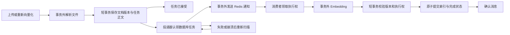

# 向量化任务持久化恢复：下一阶段实现方案与自审

状态：2026-10-02 已实现并验收 D0 及 D1 的首批接受/投递/快照恢复门，见 [阶段结果](DURABLE_VECTOR_TASK_RESULTS_2026-10-02.md)；[补充门](NOTIFICATION_CRASH_RESULTS_2026-10-02.md)另通过真实入队后退出与受控 Spring 定时扫描。**默认仍关闭，完整 App 重启与 D2 执行权/业务重试预算尚未完成。** 下文“当前链路”是设计起点的原实现。评审为执行 Agent 自审，范围限定知识库向量化。

## 1. 用户价值与需求边界

用户已经上传文件或接受重新向量化后，应用重启、短暂 Redis 故障和队列裁剪不应使任务永久卡在 PENDING。恢复应该沿用被接受请求的原文和版本，不能偷偷改成另一份内容、另一种切块配置，也不能无限重复调用付费模型。

本阶段必须实现：

- 接受成功的请求有数据库内的恢复依据；数据库事务回滚时不发送对应任务。
- 队列只是工作通知，消息正文缺失时任务正文仍可恢复。
- 新请求取代旧请求；旧请求和失去执行权的工作进程不能提交结果或失败状态。
- 投递失败、执行失败、成功提交和消息确认分开记录；持久化重试预算，不靠每条新消息重新从 0 计数。
- 正常依赖恢复后能在有界时间重新推进；不依赖用户再次上传或人工改状态。

这一阶段不承诺外部 Embedding 调用恰好一次。供应商返回前进程退出会留下不确定调用结果；数据库事务也不能回滚已经发生的外部调用。

## 2. 当前链路与明确缺口

当前已验证的版本隔离保护正式结果，但没有持久化任务正文或投递恢复表。

| 当前位置 | 当前行为 | 仍需复现的风险 |
| --- | --- | --- |
| 初次上传 | S3 上传 → 保存 PENDING 文档 → `taskService.begin` 提交版本 → Redis XADD | 保存文档到开始请求之间、开始提交到 XADD 之间退出，均可能留下无通知任务 |
| 重新向量化 | 下载/解析 → `begin` 提交 → XADD | 提交后入队前退出，没有 Pending 可供 XAUTOCLAIM 恢复 |
| 生产者失败 | 捕获 XADD 异常，尝试写 FAILED | 进程直接退出不会进入 catch；发送成功但响应丢失仍可能被误认为未发送 |
| Stream 容量 | 所有生产者/重试调用近似 MAXLEN=1000 | 正文可以被裁剪；仅调大长度不能消除故障窗口 |
| Pending 回收 | 五分钟 idle 后 XAUTOCLAIM；被裁剪 ID 仅日志记录 | 丢失正文不能从 Redis 重建；活跃但慢的消费者可能被重复接管 |
| 同 generation 并发 | PROCESSING 条件更新排除 COMPLETED，但不排除已有 PROCESSING | 两个工作进程可以同时调用 Embedding；请求版本不能区分同请求的两个执行者 |
| 上传 API | 生产者返回 void，响应构造固定 PENDING，日志说已入队 | “请求已接受”“已投递”“已完成”的含义需要拆开 |

以上为源码确认的窗口；当前报告不写成已经注入故障的实测结果。D0 须通过实际生产方法与进程退出证明它们。

另外，当前删除流程对向量删除和 S3 删除失败有仅记录日志路径。该问题进入 S4 的单独补偿实验，不与本阶段投递 A/B 混为单因素。

## 3. 调研与技术选择

### 采用数据库内的任务记录，复用现有调度和 Redis

同一数据库事务保存业务状态与待处理内容，再由独立投递器读取，是 outbox 的核心思路。Debezium 官方实现用变更捕获读取 outbox；事件 ID 也用于去重。这里学习事务边界和事件标识，选用本项目的 PostgreSQL + Spring 调度轮询实现，Redis 继续承担通知。[Debezium 官方 outbox 文档](https://debezium.io/documentation/reference/stable/transformations/outbox-event-router.html)

| 候选 | 适配与成本 | 本阶段决定 |
| --- | --- | --- |
| PostgreSQL 持久化任务 + Spring 调度 + Redis | 复用既有基础设施；需要自行验证租约、状态与故障恢复 | 采用，先受控开关验证 |
| Debezium outbox / Kafka Connect | 官方主仓和例子可查，Apache-2.0；需要增加变更捕获和独立服务运维 | 当前不引入；没有做该组合的本项目兼容实测 |
| 提高 MAXLEN / 只延长 reclaim timeout | 成本低，但仍没有数据库提交后进程退出的恢复依据 | 不能作为完成方案 |
| 只用提交后的回调或进程内事件 | 可避免事务未提交就发送，但进程退出仍可能丢失通知 | 可做加速，不能作为恢复来源 |

调研依据：[Debezium 官方示例](https://github.com/debezium/debezium-examples/tree/main/outbox)、[主仓许可证](https://github.com/debezium/debezium/blob/main/LICENSE.txt)。只评估设计与适配成本，没有把开源能力算作本项目实现。

多个投递器在短事务内使用 `FOR UPDATE SKIP LOCKED` 分批认领任务。PostgreSQL 明确该方式可用于队列表避免多消费者锁竞争，也明确它不是一般查询的一致性视图；这里仅用于可重试任务领取。[PostgreSQL 16 SELECT](https://www.postgresql.org/docs/16/sql-select.html)

调度采用现有 Spring `TaskScheduler`/`@Scheduled` 的有界轮询，明确配置线程和关闭行为；调度本身不提供任务持久化，也不替代数据库租约。[Spring 调度文档](https://docs.spring.io/spring-framework/reference/integration/scheduling.html)

当前环境是 Redis 7。最新版命令页已经包含更新版本的幂等写入等参数，不能照抄到现有实例。当前方案以现有 XADD、XAUTOCLAIM 能力为边界；即使未来增加队列侧去重，也仍需数据库任务与业务执行保护。[XADD 文档及版本标记](https://redis.io/docs/latest/commands/xadd/)、[XAUTOCLAIM 文档](https://redis.io/docs/latest/commands/xautoclaim/)、[Redis 7.2.5 Stream 源码](https://raw.githubusercontent.com/redis/redis/7.2.5/src/t_stream.c)

## 4. 预期处理链路

D 是已持久化接受，F 是实际通知成功，J 是业务结果提交；它们不能合成一个“成功”计数。投递器认领和消费者执行各有独立租约，网络调用均在事务外。

## 5. 数据与事务设计

建议新增知识库任务表，逻辑主键为 generation，父文档 ID 使用外键；正文属于被接受请求的固定快照。实现时按本项目 Repository/Service 层规则落地，不在 Controller 或 listener 内散写 JDBC 和事务。

| 字段组 | 目的与约束 |
| --- | --- |
| generation、kbId、原文件 SHA、解析正文 SHA | 请求身份与来源；generation 唯一，关联父文档 |
| parsedContent、切块配置/版本快照 | 同请求恢复不重解析其他版本的内容；正文不能进入公开日志 |
| 任务终态、executeAttempts、最后执行错误 | 业务执行恢复与共享重试预算；旧请求终态不改当前父文档 |
| deliveryAttempts、nextDeliveryAt、lastMessageId | 记录实际通知和延迟；有界退避，发送失败不丢正文 |
| deliveryOwner、deliveryLeaseUntil、deliveryFence | 多投递器认领及迟到回写保护 |
| executionOwner、executionLeaseUntil、executionFence | 同 generation 的执行权、续租与失权保护 |
| createdAt、updatedAt、completedAt | 观测积压、恢复和终态保留；用数据库时间判断租约 |

### 原子接受

初次上传在事务外完成验证、解析和 S3 上传，再由一个 Service 短事务保存文档及首个请求任务。不能继续“先保存文档，再另一个事务写任务”，否则只是移动无通知窗口。

重新向量化在事务外下载/解析，然后短事务同时设置当前 generation/PENDING、保存任务快照、标记原请求过期。任务保存失败必须回滚版本变化，不能向 Redis 发送对应通知。

S3 上传成功但数据库接受失败的孤立文件也需明确清理/补偿入口；不会通过把 S3 放入数据库事务来解决。

### 投递认领

短事务分批认领可投递任务并写 lease/fence，立即提交。随后事务外 XADD，再凭相同认领 token 更新实际 messageId 和投递时间。迟到投递器不能覆盖新的认领；XADD 成功后进程退出可能重复通知，这是允许的 at-least-once 边界。

`SENT` 不能等于任务完成，也不能使任务永久退出恢复扫描。过期且未完成、未持有有效执行租约的任务必须能重新通知，才能处理 Redis 消息被裁剪或丢失。

首次入队失败后保留“已接受、等待投递”的恢复状态，需要同时修改 API 状态/提示和指标口径。不能保留旧的“写 FAILED 即终止”行为，又在后台偷偷恢复该终态。

### 执行认领与提交

消费者从数据库任务领取执行权，成功后才调用 Embedding。续租使用独立调度能力，不能排在正在阻塞 Embedding 的同一个执行线程后面。租约不能只检查一次：提交与 FAILED 写回均验证 generation + executionFence + owner，必要时核对租约有效期。

活跃租约下的重复消息不开始第二个模型调用。消息是否确认必须建立在数据库恢复依据确实存在的前提上；失去租约的旧工作进程取消本地调用、清理自己的临时 jobId，禁止提交正式结果。

同一请求的实际执行预算持久化，通知重发不重置预算。供应商 SDK 内部重试另行记录，不能把“执行尝试次数”误称为外部 HTTP 请求次数。

### 完成与删除

正式向量、父文档 COMPLETED/chunkCount 和任务 COMPLETED 在同一个短事务提交。完成前崩溃可恢复；完成后 ACK 前崩溃仍走已验证的完成检查。

涉及父文档与任务两张表时统一锁顺序，先父文档、再任务；投递认领仅锁任务并立即提交，不能持有任务锁再等待父文档，避免反向锁顺序。删除父文档时任务快照随外键处理；完成记录按配置保留并清理。对含简历/私人资料的正文，不导出到公开成果包。

## 6. 故障实验与阶段门

| 阶段 | 单独变化项与实验 | 必须观察 |
| --- | --- | --- |
| D0 原实现复现 | 真实子 JVM 在 begin 提交后、XADD 前退出 | 真实退出码、PENDING/gen 已提交、对应消息/PEL 为 0、原消费者重启无法自动推进 |
| D0 裁剪复现 | 只裁剪自己建立的 Stream/消息，不裁剪公共实验队列 | 正文缺失、PEL/reclaim 的实际结果、没有恢复依据时无法完成 |
| D1 原子任务接受 | 同事务文档状态+正文任务，投递器恢复 | 原来退出点重启可完成；任务保存拒绝时版本/状态一起回滚，无对应 XADD |
| D1 发送不确定 | 实际 XADD 后、投递状态写回前真实退出 | 可重复通知，但 generation/正文相同，最终索引和任务状态唯一有效 |
| D1 Redis 故障 | 实际 ACL 拒绝 XADD，撤销故障后恢复 | 任务正文保留，实际发送计数真实，恢复无需用户重新上传 |
| D2 活跃执行 | 两个实际工作进程接管同请求；一方持续续租 | 有效租约内第二方不调用 Embedding，不覆盖执行者状态 |
| D2 失权迟到 | 停止旧续租，接管后释放旧屏障 | 旧成功/旧失败均不能写回；最新 executionFence 和正式向量保持一致 |
| D2 预算与停止 | 多次进程退出/通知重发、关闭时处理中任务 | 执行预算不重置，无无限调用；可恢复任务不会因关闭被误确认完成 |
| D3 丢正文恢复 | 实际删/裁剪任务通知，正文仍在任务表 | 依靠持久化快照重新通知并完成，非手工重建正文 |
| D3 兼容与产品 | 显式迁移/回滚、实际上传/重向量化/检索/删除 | 旧完成索引不变，未完成任务有受控清单，API 提示与状态一致 |

D0 的超时观察只证明该受控窗口无自动恢复，不能证明生产无限期不可恢复。模拟推进 idle 用于正确性实验时单列；恢复速度测量使用实际时钟和相同配置，不通过推进时间生成漂亮延迟。

D1 和 D2 分开保存 A/B，但开启默认持久化恢复前必须通过两组关键门，避免自动重发使并发模型成本失控。所有公共后端改动执行完整 fresh run，并重跑本轮版本隔离/原有故障门。新输出目录不能覆盖已有结果。

## 7. 观测、参数和上线边界

- 固定标签统计：accepted、dispatch_success/failure、execute_start、complete/failed/obsolete、recovered；不得将 generation/kbId 作为 Prometheus 标签。
- 数据库指标：待投递数、最老等待时间、未完成任务数、有效/过期租约数；Redis lag/PEL 保留，但两者不是同一个积压口径。
- 新配置集中在 `@ConfigurationProperties`：启用开关、扫描周期、认领批量、投递退避、调用超时、租约/续租周期、保留期限。
- 参数先以小批故障实验确定。目标是依赖恢复后若干正常扫描周期内重新推进；此处不给尚未测试的恢复 SLA 或可靠性百分比。
- 未完成旧任务不能凭空推断正文或版本。切换前停止旧写入/消费者，逐项对齐存储文件、现有消息、父文档版本；缺正文的任务明确标记待恢复，不能用 ACK 或改 COMPLETED 排空。
- 完成旧文档可继续保留 NULL generation/无任务记录；默认开关开启前提供显式迁移、清点与回滚说明。
- 终态之外的任务不得因 TTL/清理失去恢复依据；Redis 长度策略与数据保留另按真实积压评估，不照搬新版命令。

## 8. 自审记录与下一动作

| 评审问题 | 修订/决定 |
| --- | --- |
| 只补 begin→XADD，首上传保存仍有窗口 | 原子接受涵盖首上传文档创建和任务正文 |
| XADD 成功后才把任务写 SENT，退出会重复发送 | 接受至少一次通知，另以执行租约/fence 防重复有效提交 |
| SENT 后不再扫描，裁剪仍永久丢失 | 恢复扫描以未完成业务及有效执行权为依据 |
| 自动重发导致反复付费模型调用 | D2 为默认开启前必选门，执行预算在任务表持久化 |
| lease 有了但旧执行者仍提交 | 提升、完成、失败写回均验证 executionFence |
| DB 任务正文成为私人资料副本 | 随父文档处理，限制日志和成果导出，配置终态保留 |
| outbox 锁把 Redis/Embedding 放入事务 | 认领提交后才调用外部能力，所有状态回写短事务 |
| 改四类消费者范围过大 | 首轮只知识库；其他任务仍保留现有异常传播回归 |
| 只有自审，没有独立评审 | 如实记录；代码与原始实验为后续可复核材料，不写独立审核已通过 |

下一动作：按 [D2 具体方案](VECTOR_EXECUTION_LEASE_DESIGN_2026-10-02.md)先复现双消费者重复计算，再实现执行租约、心跳、fence 和持久化业务尝试预算，验证多工作进程及锁等待过期。首批与补充门分目录冻结，后续不能覆盖首次失败和公平复跑证据。S1/S2/S3 的语音与 RAG 效果任务继续保留；本方案完成不能代替整体目标完成。
